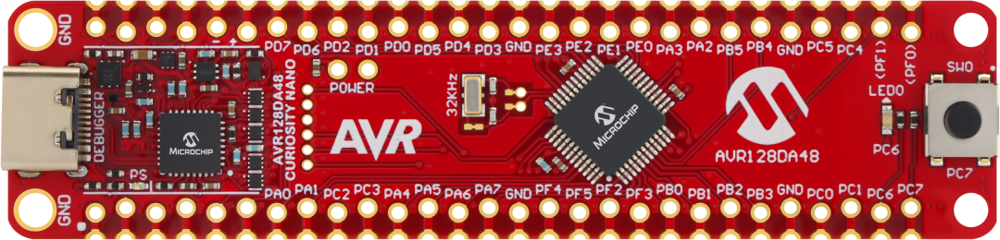

<!-- Please do not change this logo with link -->
[](https://www.microchip.com)

# Getting Started With the 8-bit MDFU Client for AVR128DA48 Using MCP2222 and pymdfu

This document describes the validated setup for using the **8-bit MDFU Client** on the **AVR128DA48 Curiosity Nano Evaluation Board** with the **MCP2222 USB bridge** and the `pymdfu` host tool.

The setup covers firmware update over the following communication protocols:

- UART using MCP2222 CDC/serial interface
- SPI using MCP2222 USB-to-SPI bridge
- I<sup>2</sup>C using MCP2222 USB-to-I<sup>2</sup>C bridge

The MDFU client/bootloader runs on the AVR128DA48 target. The PC-side `pymdfu` tool sends an MDFU application image to the bootloader through MCP2222. The bootloader receives the image, validates it, and programs it into the AVR128DA48 application flash region.

This setup demonstrates:

- How to use the AVR128DA48 MDFU client projects for UART, SPI, and I<sup>2</sup>C
- How to program the MDFU client/bootloader onto the AVR128DA48 Curiosity Nano
- How to connect MCP2222 to AVR128DA48 for UART, SPI, and I<sup>2</sup>C
- How to use `pymdfu` with MCP2222 to update the application firmware
- How to verify a successful MDFU update

---

## Related Documentation

- [AVR128DA48 Family Product Page](https://www.microchip.com/en-us/product/AVR128DA48)
- [AVR128DA48 Curiosity Nano](https://www.microchip.com/en-us/development-tool/DM164151)
- [8-Bit MDFU Client Documentation](https://onlinedocs.microchip.com/v2/keyword-lookup?keyword=8BIT_MDFU_CLIENT&version=latest&redirect=true)
- [pymdfu on PyPI](https://pypi.org/project/pymdfu/)
- [pyfwimagebuilder on PyPI](https://pypi.org/project/pyfwimagebuilder/)

---

## Software Used

The following tools were used or referenced during validation:

- MPLAB&reg; X IDE
- MPLAB&reg; XC8 Compiler
- MPLAB&reg; Code Configurator (MCC) Melody
- Python 3.11
- `pymdfu` from the updated `develop` branch
- MCP2222 firmware project

Validated `pymdfu` version:

```text
pymdfu version 2.9.0.0+snapshot
MDFU protocol version 1.3.0
```

The working `pymdfu.exe` path was:

```text
C:\Users\I73904\AppData\Roaming\Python\Python311\Scripts\pymdfu.exe
```

To verify that the installed `pymdfu` supports MCP2222:

```cmd
C:\Users\I73904\AppData\Roaming\Python\Python311\Scripts\pymdfu.exe tools-help
```

The output must include:

```text
Microchip Mcp2222 USB to I2C/SPI bridge
```

---

## Hardware Used

- AVR128DA48 Curiosity Nano Evaluation Board
- MCP2222 USB bridge board
- PC running Windows
- Jumper wires for UART, SPI, and I<sup>2</sup>C connections

AVR128DA48 Curiosity Nano:

[](images/230928-mcu8-photo-dm164151-front-transparent.PNG)

---

## System Overview

The complete update path is:

```text
PC
 |
 | pymdfu
 |
USB
 |
MCP2222 USB bridge
 |
 | UART / SPI / I2C
 |
AVR128DA48 Curiosity Nano
 |
MDFU client / bootloader
 |
Application flash
```

The MCP2222 acts only as the communication bridge. The actual firmware update logic is implemented in the MDFU client/bootloader running on the AVR128DA48.

---

## Bootloader and Application Concept

Two firmware components are involved:

```text
1. MDFU client / bootloader
2. Application image
```

### MDFU Client / Bootloader

The MDFU client/bootloader is programmed first using MPLAB X and the Curiosity Nano onboard debugger/nEDBG.

It is responsible for:

- Receiving MDFU commands from `pymdfu`
- Receiving the application image
- Writing the application image into flash
- Validating the image
- Starting the application after successful update

### Application Image

The application image is the `.img` file sent later using `pymdfu`.

The `.img` file is not programmed directly through MPLAB X. It is transferred through MDFU using UART, SPI, or I<sup>2</sup>C.

Use matching bootloader and application image pairs:

```text
UART CRC32 bootloader -> UART CRC32 application image
SPI CRC32 bootloader  -> SPI CRC32 application image
I2C CRC32 bootloader  -> I2C CRC32 application image
```

---

## Project Locations

### UART MDFU Client Project

```text
C:\Users\I73904\Downloads\avr128da48-cnano-8bit-mdfu-client-mplab-mcc-master\avr128da48-cnano-8bit-mdfu-client-mplab-mcc-master\uart\crc32\avr128da48-mdfu-client-crc32.X
```

### SPI MDFU Client Project

```text
C:\Users\I73904\Downloads\avr128da48-cnano-8bit-mdfu-client-mplab-mcc-master\avr128da48-cnano-8bit-mdfu-client-mplab-mcc-master\spi\avr128da48-mdfu-client-crc32.X
```

### I<sup>2</sup>C MDFU Client Project

```text
C:\Users\I73904\Downloads\avr128da48-cnano-8bit-mdfu-client-mplab-mcc-master\avr128da48-cnano-8bit-mdfu-client-mplab-mcc-master\i2c\avr128da48-mdfu-client-crc32.X
```

---

## Bootloader HEX Files

### UART Bootloader HEX

```text
C:\Users\I73904\Downloads\avr128da48-cnano-8bit-mdfu-client-mplab-mcc-master\avr128da48-cnano-8bit-mdfu-client-mplab-mcc-master\uart\crc32\avr128da48-mdfu-client-crc32.X\dist\free\production\avr128da48-mdfu-client-crc32.X.production.hex
```

### SPI Bootloader HEX

```text
C:\Users\I73904\Downloads\avr128da48-cnano-8bit-mdfu-client-mplab-mcc-master\avr128da48-cnano-8bit-mdfu-client-mplab-mcc-master\spi\avr128da48-mdfu-client-crc32.X\dist\free\production\avr128da48-mdfu-client-crc32.X.production.hex
```

### I<sup>2</sup>C Bootloader HEX

```text
C:\Users\I73904\Downloads\avr128da48-cnano-8bit-mdfu-client-mplab-mcc-master\avr128da48-cnano-8bit-mdfu-client-mplab-mcc-master\i2c\avr128da48-mdfu-client-crc32.X\dist\free\production\avr128da48-mdfu-client-crc32.X.production.hex
```

---

## Application Image Files

### UART Application Image

```text
C:\Users\I73904\Downloads\avr128da48-cnano-8bit-mdfu-client-mplab-mcc-master\avr128da48-cnano-8bit-mdfu-client-mplab-mcc-master\uart\crc32\avr128da48-application-crc32.X\new_application.img
```

### SPI Application Image

```text
C:\Users\I73904\Downloads\avr128da48-cnano-8bit-mdfu-client-mplab-mcc-master\avr128da48-cnano-8bit-mdfu-client-mplab-mcc-master\spi\avr128da48-application-crc32.X\new_application.img
```

### I<sup>2</sup>C Application Image

```text
C:\Users\I73904\Downloads\avr128da48-cnano-8bit-mdfu-client-mplab-mcc-master\avr128da48-cnano-8bit-mdfu-client-mplab-mcc-master\i2c\avr128da48-application-crc32.X\new_application.img
```

---

## MCP2222 Firmware Reference

The MCP2222 firmware project used as reference is located at:

```text
D:\ASSP\repos\mcp2222-firmware-RC5\mcp2222_firmware.X
```

During testing, `pymdfu` detected the MCP2222 as:

```text
VID: 04d8
PID: 0b15
Product Name: MCP2222 USB Bridge
```

---

## Hardware Setup

## SPI Hardware Setup

The SPI MDFU project uses SPI0 on the AVR128DA48.

Validated SPI wiring:

```text
MCP2222 SCK   -> AVR128DA48 PA6 / SPI0 SCK
MCP2222 MOSI  -> AVR128DA48 PA4 / SPI0 MOSI
MCP2222 MISO  -> AVR128DA48 PA5 / SPI0 MISO
MCP2222 CS0   -> AVR128DA48 PA7 / SPI0 SS
MCP2222 GND   -> AVR128DA48 GND
```

Validated SPI settings:

```text
Clock speed: 375000 Hz
SPI mode: 0
CS pin: 0
CS polarity: low
Delay: 500 us
```

---

## UART Hardware Setup

The UART MDFU client project uses:

```text
USART1
Baudrate: 9600
```

The generated UART initialization contains:

```c
USART1.BAUD = (uint16_t)USART1_BAUD_RATE(9600UL);
```

The UART pins are:

```text
USART1 TXD -> PC0
USART1 RXD -> PC1
```

Validated UART wiring:

```text
MCP2222 TXD  -> AVR128DA48 PC1 / USART1 RXD
MCP2222 RXD  -> AVR128DA48 PC0 / USART1 TXD
MCP2222 GND  -> AVR128DA48 GND
```

Important:

```text
UART TX and RX must be crossed.
MCP2222 TXD connects to AVR RXD.
MCP2222 RXD connects to AVR TXD.
```

---

## I<sup>2</sup>C Hardware Setup

The I<sup>2</sup>C MDFU project uses TWI0.

The generated pin configuration contains:

```c
PORTMUX.TWIROUTEA = 0x2;
```

This routes TWI0 to PORTC pins.

Expected I<sup>2</sup>C wiring:

```text
MCP2222 SDA  -> AVR128DA48 PC2 / TWI0 SDA
MCP2222 SCL  -> AVR128DA48 PC3 / TWI0 SCL
MCP2222 GND  -> AVR128DA48 GND
```

I<sup>2</sup>C pull-ups are required on SDA and SCL.

If the board does not already provide pull-ups, use external pull-ups, for example:

```text
SDA -> 4.7 kΩ -> VCC
SCL -> 4.7 kΩ -> VCC
```

I<sup>2</sup>C address used:

```text
Decimal: 32
Hex:     0x20
```

---

## Setup

## Client Setup

For each protocol, first open and program the corresponding MDFU client/bootloader project using MPLAB X.

### UART Client Setup

Open:

```text
uart\crc32\avr128da48-mdfu-client-crc32.X
```

Program the project to the AVR128DA48 Curiosity Nano.

Use the UART wiring:

```text
MCP2222 TXD -> PC1 / USART1 RXD
MCP2222 RXD -> PC0 / USART1 TXD
MCP2222 GND -> GND
```

Use baudrate:

```text
9600
```

---

### SPI Client Setup

Open:

```text
spi\avr128da48-mdfu-client-crc32.X
```

Program the project to the AVR128DA48 Curiosity Nano.

Use the SPI wiring:

```text
MCP2222 SCK  -> PA6 / SPI0 SCK
MCP2222 MOSI -> PA4 / SPI0 MOSI
MCP2222 MISO -> PA5 / SPI0 MISO
MCP2222 CS0  -> PA7 / SPI0 SS
MCP2222 GND  -> GND
```

Use SPI settings:

```text
Clock speed: 375000 Hz
Mode: 0
CS pin: 0
CS polarity: low
Delay: 500 us
```

---

### I<sup>2</sup>C Client Setup

Open:

```text
i2c\avr128da48-mdfu-client-crc32.X
```

Program the project to the AVR128DA48 Curiosity Nano.

Use the I<sup>2</sup>C wiring:

```text
MCP2222 SDA -> PC2 / TWI0 SDA
MCP2222 SCL -> PC3 / TWI0 SCL
MCP2222 GND -> GND
```

Use I<sup>2</sup>C settings:

```text
Clock speed: 100000 Hz
Address: 32 decimal / 0x20 hex
```

---

## Application Setup

For each protocol, build the matching application project and generate the `.img` file.

Use the matching image for each bootloader:

```text
UART bootloader -> uart\crc32\avr128da48-application-crc32.X\new_application.img
SPI bootloader  -> spi\avr128da48-application-crc32.X\new_application.img
I2C bootloader  -> i2c\avr128da48-application-crc32.X\new_application.img
```

Do not mix images from a different protocol folder unless the bootloader configuration and image configuration are known to be compatible.

---

## Operation

The general operation is:

1. Program the required MDFU client/bootloader project using MPLAB X.
2. Connect MCP2222 to the AVR128DA48 using the correct protocol wiring.
3. Run `client-info` to verify communication.
4. Run `update` to transfer the application image.
5. Confirm that the update ends with:

```text
Upgrade finished successfully
```

---

## UART Operation

### UART Client Info

Run this first:

```cmd
C:\Users\I73904\AppData\Roaming\Python\Python311\Scripts\pymdfu.exe -v debug client-info --tool serial --port COM29 --baudrate 9600
```

Expected result:

```text
MDFU client information
```

### UART Firmware Update

```cmd
C:\Users\I73904\AppData\Roaming\Python\Python311\Scripts\pymdfu.exe -v debug update --tool serial --port COM29 --baudrate 9600 --image "C:\Users\I73904\Downloads\avr128da48-cnano-8bit-mdfu-client-mplab-mcc-master\avr128da48-cnano-8bit-mdfu-client-mplab-mcc-master\uart\crc32\avr128da48-application-crc32.X\new_application.img"
```

Expected success message:

```text
Upgrade finished successfully
```

---

## SPI Operation

### SPI Client Info

Run this first:

```cmd
C:\Users\I73904\AppData\Roaming\Python\Python311\Scripts\pymdfu.exe -v debug client-info --tool mcp2222 --interface spi --clk-speed 375_000 --mode 0 --cs-pin 0 --cs-polarity low --delay 500
```

Expected result:

```text
MDFU client information
```

Observed client information during validation:

```text
MDFU protocol version: 1.2.0
Number of command buffers: 1
Maximum packet data length: 527 bytes
Inter transaction delay: 0.0015 seconds
Default timeout: 10.0 seconds
```

### SPI Firmware Update

```cmd
C:\Users\I73904\AppData\Roaming\Python\Python311\Scripts\pymdfu.exe -v debug update --tool mcp2222 --interface spi --image "C:\Users\I73904\Downloads\avr128da48-cnano-8bit-mdfu-client-mplab-mcc-master\avr128da48-cnano-8bit-mdfu-client-mplab-mcc-master\spi\avr128da48-application-crc32.X\new_application.img" --clk-speed 375_000 --mode 0 --cs-pin 0 --cs-polarity low --delay 500
```

Expected success message:

```text
Upgrade finished successfully
```

Validated SPI update result:

```text
Update Progress: 100%
pymdfu.pymdfu - INFO - Upgrade finished successfully
```

During the successful SPI update, the following MDFU command sequence was observed:

```text
GET_CLIENT_INFO
START_TRANSFER
WRITE_CHUNK
GET_IMAGE_STATE
END_TRANSFER
```

The image state returned:

```text
Data: 0x01
```

This indicates that the received image was valid.

---

## I<sup>2</sup>C Operation

### I<sup>2</sup>C Client Info

Run this first:

```cmd
C:\Users\I73904\AppData\Roaming\Python\Python311\Scripts\pymdfu.exe -v debug client-info --tool mcp2222 --interface i2c --clk-speed 100_000 --address 32
```

Equivalent address format:

```cmd
--address 0x20
```

### I<sup>2</sup>C Firmware Update

```cmd
C:\Users\I73904\AppData\Roaming\Python\Python311\Scripts\pymdfu.exe -v debug update --tool mcp2222 --interface i2c --clk-speed 100_000 --address 32 --image "C:\Users\I73904\Downloads\avr128da48-cnano-8bit-mdfu-client-mplab-mcc-master\avr128da48-cnano-8bit-mdfu-client-mplab-mcc-master\i2c\avr128da48-application-crc32.X\new_application.img"
```

Expected success message:

```text
Upgrade finished successfully
```

---

## Supported MCP2222 Clock Speeds

## SPI Clock Speeds

The MCP2222 SPI interface supports:

```text
187500 Hz
375000 Hz
750000 Hz
1500000 Hz
3000000 Hz
6000000 Hz
12000000 Hz
```

Known-good validated SPI speed:

```text
375000 Hz
```

Known-good validated SPI command:

```cmd
C:\Users\I73904\AppData\Roaming\Python\Python311\Scripts\pymdfu.exe -v debug update --tool mcp2222 --interface spi --image "C:\Users\I73904\Downloads\avr128da48-cnano-8bit-mdfu-client-mplab-mcc-master\avr128da48-cnano-8bit-mdfu-client-mplab-mcc-master\spi\avr128da48-application-crc32.X\new_application.img" --clk-speed 375_000 --mode 0 --cs-pin 0 --cs-polarity low --delay 500
```

---

## I<sup>2</sup>C Clock Speeds

The MCP2222 I<sup>2</sup>C interface supports:

```text
100000 Hz
400000 Hz
1000000 Hz
```

Recommended initial I<sup>2</sup>C test speed:

```text
100000 Hz
```

Known command format:

```cmd
C:\Users\I73904\AppData\Roaming\Python\Python311\Scripts\pymdfu.exe -v debug update --tool mcp2222 --interface i2c --clk-speed 100_000 --address 32 --image "C:\Users\I73904\Downloads\avr128da48-cnano-8bit-mdfu-client-mplab-mcc-master\avr128da48-cnano-8bit-mdfu-client-mplab-mcc-master\i2c\avr128da48-application-crc32.X\new_application.img"
```

---

## UART Baudrate

The UART MDFU client uses:

```text
9600 baud
```

This was confirmed from the generated initialization code:

```c
USART1.BAUD = (uint16_t)USART1_BAUD_RATE(9600UL);
```

Known command format:

```cmd
C:\Users\I73904\AppData\Roaming\Python\Python311\Scripts\pymdfu.exe -v debug update --tool serial --port COM29 --baudrate 9600 --image "C:\Users\I73904\Downloads\avr128da48-cnano-8bit-mdfu-client-mplab-mcc-master\avr128da48-cnano-8bit-mdfu-client-mplab-mcc-master\uart\crc32\avr128da48-application-crc32.X\new_application.img"
```

---

## Test Coverage

## pymdfu Installation Validation

Verified that the installed `pymdfu` supports MCP2222.

Command:

```cmd
C:\Users\I73904\AppData\Roaming\Python\Python311\Scripts\pymdfu.exe tools-help
```

Confirmed supported tools include:

```text
serial
mcp2222
```

---

## MCP2222 Detection

Verified that `pymdfu` detects the MCP2222 device.

Observed output:

```text
Found 1 MCP2222 devices
Device VID=04d8, PID=0b15
Product Name=MCP2222 USB Bridge
```

---

## SPI Client Info Test

Command:

```cmd
C:\Users\I73904\AppData\Roaming\Python\Python311\Scripts\pymdfu.exe -v debug client-info --tool mcp2222 --interface spi --clk-speed 375_000 --mode 0 --cs-pin 0 --cs-polarity low --delay 500
```

Result:

```text
MDFU client information received successfully
```

---

## SPI Firmware Update Test

Command:

```cmd
C:\Users\I73904\AppData\Roaming\Python\Python311\Scripts\pymdfu.exe -v debug update --tool mcp2222 --interface spi --image "C:\Users\I73904\Downloads\avr128da48-cnano-8bit-mdfu-client-mplab-mcc-master\avr128da48-cnano-8bit-mdfu-client-mplab-mcc-master\spi\avr128da48-application-crc32.X\new_application.img" --clk-speed 375_000 --mode 0 --cs-pin 0 --cs-polarity low --delay 500
```

Result:

```text
Upgrade finished successfully
```

---

## UART Pin and Baudrate Validation

Validated UART configuration:

```text
USART1
Baudrate: 9600
TXD: PC0
RXD: PC1
```

Validated wiring:

```text
MCP2222 TXD -> PC1 / USART1 RXD
MCP2222 RXD -> PC0 / USART1 TXD
MCP2222 GND -> GND
```

---

## I<sup>2</sup>C Pin Mapping Validation

Validated from generated `pins.c`:

```c
PORTMUX.TWIROUTEA = 0x2;
```

Resulting TWI0 pins:

```text
TWI0 SDA -> PC2
TWI0 SCL -> PC3
```

Expected wiring:

```text
MCP2222 SDA -> PC2 / TWI0 SDA
MCP2222 SCL -> PC3 / TWI0 SCL
MCP2222 GND -> GND
```

---

## Running Commands From Any Path

The commands use the full path to `pymdfu.exe`:

```text
C:\Users\I73904\AppData\Roaming\Python\Python311\Scripts\pymdfu.exe
```

Therefore, the commands can be run from any directory.

Example:

```cmd
cd C:\
C:\Users\I73904\AppData\Roaming\Python\Python311\Scripts\pymdfu.exe --version
```

To use only:

```cmd
pymdfu
```

instead of the full path, add this directory to the Windows PATH:

```text
C:\Users\I73904\AppData\Roaming\Python\Python311\Scripts
```

Then open a new Command Prompt and verify:

```cmd
where pymdfu
pymdfu --version
```

---

## Known Good Summary

## UART

```text
Bootloader:
uart\crc32\avr128da48-mdfu-client-crc32.X

Application:
uart\crc32\avr128da48-application-crc32.X\new_application.img

Wiring:
MCP2222 TXD -> PC1 / USART1 RXD
MCP2222 RXD -> PC0 / USART1 TXD
MCP2222 GND -> GND

Baudrate:
9600

Command:
pymdfu update --tool serial --port COM29 --baudrate 9600 --image <uart image>
```

---

## SPI

```text
Bootloader:
spi\avr128da48-mdfu-client-crc32.X

Application:
spi\avr128da48-application-crc32.X\new_application.img

Wiring:
MCP2222 SCK  -> PA6 / SPI0 SCK
MCP2222 MOSI -> PA4 / SPI0 MOSI
MCP2222 MISO -> PA5 / SPI0 MISO
MCP2222 CS0  -> PA7 / SPI0 SS
MCP2222 GND  -> GND

Settings:
Clock speed: 375000 Hz
Mode: 0
CS pin: 0
CS polarity: low
Delay: 500 us

Command:
pymdfu update --tool mcp2222 --interface spi --clk-speed 375_000 --mode 0 --cs-pin 0 --cs-polarity low --delay 500 --image <spi image>
```

---

## I<sup>2</sup>C

```text
Bootloader:
i2c\avr128da48-mdfu-client-crc32.X

Application:
i2c\avr128da48-application-crc32.X\new_application.img

Wiring:
MCP2222 SDA -> PC2 / TWI0 SDA
MCP2222 SCL -> PC3 / TWI0 SCL
MCP2222 GND -> GND

Settings:
Clock speed: 100000 Hz
Address: 32 decimal / 0x20 hex

Command:
pymdfu update --tool mcp2222 --interface i2c --clk-speed 100_000 --address 32 --image <i2c image>
```

---

## Final Validation Criteria

A firmware update is considered successful when the `pymdfu update` command ends with:

```text
Upgrade finished successfully
```

For the successful SPI update, the following was observed:

```text
Update Progress: 100%
pymdfu.pymdfu - INFO - Upgrade finished successfully
```

A valid image state is indicated by:

```text
GET_IMAGE_STATE
Data: 0x01
```

---

## Summary

This setup validates the use of the AVR128DA48 8-bit MDFU client with the MCP2222 USB bridge and `pymdfu`.

The following paths were established:

```text
UART:
PC -> MCP2222 CDC/serial -> AVR128DA48 USART1 -> MDFU client

SPI:
PC -> MCP2222 SPI -> AVR128DA48 SPI0 -> MDFU client

I2C:
PC -> MCP2222 I2C -> AVR128DA48 TWI0 -> MDFU client
```

The SPI update path was fully validated with a successful application image update. UART and I<sup>2</sup>C hardware mappings and command formats were identified for corresponding MDFU client projects.

---

## Contents

- [Back to Related Documentation](#related-documentation)
- [Back to Software Used](#software-used)
- [Back to Hardware Used](#hardware-used)
- [Back to System Overview](#system-overview)
- [Back to Hardware Setup](#hardware-setup)
- [Back to Operation](#operation)
- [Back to Test Coverage](#test-coverage)
- [Back to Summary](#summary)
- [Back to Top](#getting-started-with-the-8-bit-mdfu-client-for-avr128da48-using-mcp2222-and-pymdfu)